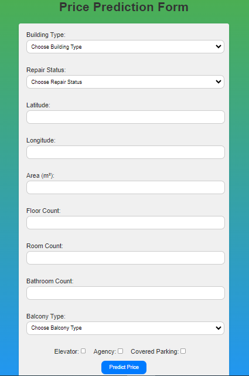
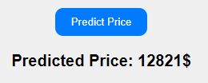
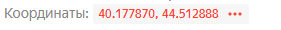
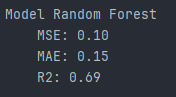

# House Price Prediction Application for Armenia

---

Welcome to the House Price Prediction application repository, designed to work seamlessly with my ML model tailored for predicting house prices in Armenia!

## Overview

---
This repository hosts the codebase for our House Price Prediction application, which integrates with our ML model to provide users with the ability to forecast house prices that can be sold within Armenia's real estate market landscape. The application offers a user-friendly interface for interacting with the model, making it easy for users to obtain accurate house price predictions.

## Features

---
- Seamlessly integrates with our ML model for accurate house price predictions.
- User-friendly interface for ease of use.
- Tailored specifically for Armenia's real estate market landscape.

## Getting Started

---
To get started with using our House Price Prediction application, follow these steps:

1. Clone this repository to your local machine.
2. Install the required dependencies by running:       
`pip install -r requirements.txt`    
This will install all the necessary packages listed in the `requirements.txt` file.
3. Run `house.parse_link()` in `parse_logic.py` to obtain the necessary data. (Note: The data file is over 100MB and cannot be included in this repository. Your data should look like this after parsing [Example Data](Data/first_10_rows.csv)).
4. Run `Analyse.ipynb` to model the ML model. (Note: The model file is over 600MB and cannot be included in this repository).
5. Run the application using `app.py`.

## Usage

---
After running `app.py` on `http://127.0.0.1:5000` you will see this page.    

   

After clicking the `Predict Price` button, the price will appear below the button.

Note! You can find house latitude and longtitude [here](https://yandex.com/maps/)

## Documentation

---
For detailed documentation and usage instructions, please refer to our Sphinx documentation:
[Project Documentation](https://estateanalysis.onrender.com)

## Model Information

---
For price prediction is used RandomForest model that fits best for needs of accurate prediction.
Screenshot of model's Mean Squared Error, Mean Absolute Error, and R^2 score (R-squared).     
   

## License

---
This project is licensed under the [Creative Commons Attribution-NonCommercial-ShareAlike 4.0 International](https://creativecommons.org/licenses/by-nc-sa/4.0/legalcode.txt) License. See the [LICENSE](LICENSE) file for details.

## Contact

---
If you have any questions or feedback, feel free to reach out to me at [robertarustamyan2@gmail.com](https://mail.google.com/mail/u/0/?fs=1&to=robertarustamyan2@gmail.com).
